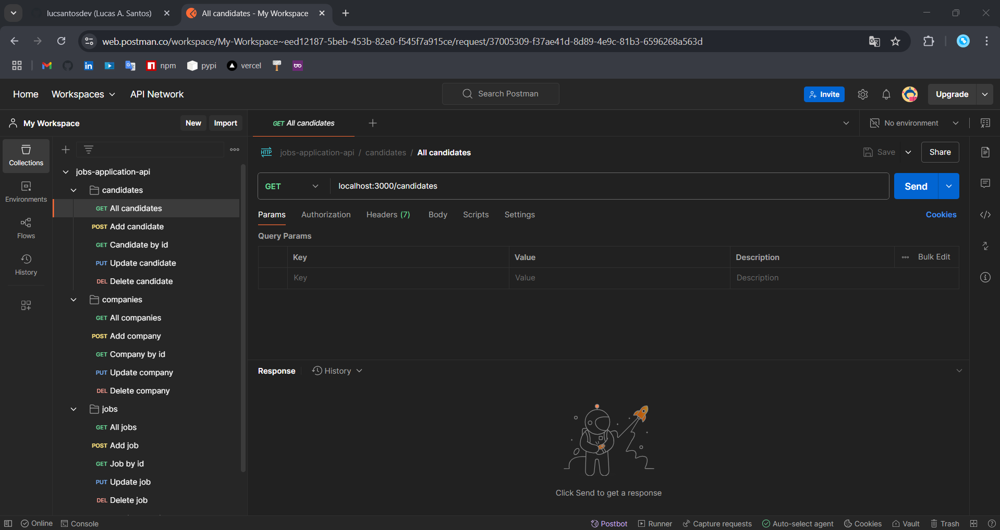

# jobs-application-api
> This project is a REST API simulates the backend of a Job Application.

## 🚀 Project Description  
This is a REST API using Sequelize and Typescript, as well as the Node.js Express framework and the PostgreSQL database. This API simulates the backend of a Job Application. In this app, candidates can register and then apply for jobs. Companies can also register and create job openings for candidates to apply for.

---

## ✨ Functionalities  
- **Database:** Sequelize CLI configuration and table creation through migrations, seeders and their models. 
- **Endpoints:** Separation of application logic into route files and controllers that work with REST requests (create, read, update and delete) received.
- **Relationships in Sequelize:** Implementation and management of relationships between database table data (One-to-Many Relationships and Many-to-Many Relationships).

---

## 🛠️ Technologies Used  
| Technology        | Description         |  
|--------------------|---------------------|  
| TypeScript          | Development Language     | 
| Node JS          | Backend Development      |  
| Express JS          | Backend Development      |  
| PostgreSQL          | Data Base Storage      |   
| Postman          | API Testing     | 

---

---

## 📝 License
This project is licensed under the MIT License. See the LICENSE file for details.

---

## 💬 Connect with Me
Follow my journey and other projects on:
- **Email:** [lucsantosdev@gmail.com](mailto:lucsantosdev@gmail.com)
- **LinkedIn:** [lucsantosdev](https://www.linkedin.com/in/lucsantosdev)
- **GitHub:** [lucsantosdev](https://github.com/lucsantosdev)

---

🧠 Je 9:23-24